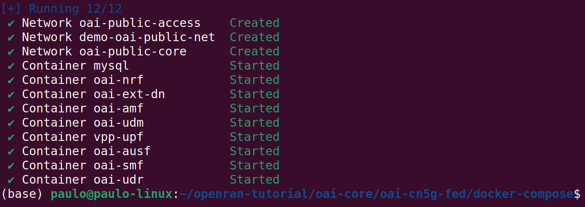

# Tutorial: Deploy End-to-End do Core 5G com Docker

Este documento apresenta um passo a passo completo para instalação e execução do núcleo da rede 5G (5G Core) utilizando contêineres Docker, com base no projeto OpenAirInterface (OAI).

O objetivo é criar um ambiente funcional para fins de estudo, testes e integração com outros elementos da arquitetura Open RAN, como o RIC e agentes E2.

Este tutorial é voltado a iniciantes que desejam entender como rodar o 5G Core localmente de forma modular e reproduzível.

---

## Fluxo de Ações

1. Preparar o sistema operacional (Ubuntu 22.04)
2. Instalar ferramentas e dependências básicas
3. Instalar Docker e Docker Compose
4. Clonar o repositório do 5G Core (OAI CN5G)
5. Criar o arquivo de ambiente (.env)
6. Executar o Core via Docker Compose
7. Verificar os containers e a rede interna
8. Encerrar o ambiente com segurança

---

## 1. Preparar o Sistema Operacional

O ambiente foi configurado em um sistema Ubuntu 22.04.5 LTS. A instalação foi realizada manualmente, mas pode ser feita em máquina virtual ou bare-metal.

Verificar versão:
```bash
lsb_release -a
```

---

## 2. Instalar Dependências Básicas

```bash
sudo apt update && sudo apt install -y \
  git curl wget net-tools gnupg lsb-release \
  apt-transport-https software-properties-common
```

---

## 3. Instalar Docker e Docker Compose

```bash
curl -fsSL https://get.docker.com -o get-docker.sh
sudo sh get-docker.sh
sudo usermod -aG docker $USER
```

Após reiniciar, teste:

```bash
docker --version
docker run hello-world
```

Instalar Docker Compose:

```bash
sudo apt install docker-compose -y
docker-compose --version
```

---

## 4. Clonar o Repositório do 5G Core (OAI CN5G)

```bash
mkdir -p ~/openran-tutorial/oai-core
cd ~/openran-tutorial/oai-core
git clone https://gitlab.eurecom.fr/oai/cn5g/oai-cn5g-fed.git
cd oai-cn5g-fed/docker-compose
```

---

## 5. Criar o Arquivo `.env`

```bash
nano .env
```

Conteúdo sugerido:
```env
USE_VPP=yes
USE_NRF=yes
NRF_FQDN=nrf.oai-cn5g.org
REGISTER_NF=yes
DISCOVER_UPF=yes
USE_HELM=no
USE_DOCKER=yes
DOCKER_REGISTRY=localhost
DOCKER_USERNAME=oai
DOCKER_TAG=latest
```

---

## 6. Executar o Core com Docker Compose

```bash
docker compose -f docker-compose-basic-vpp-nrf.yaml up -d
```
A saída deverá ser algo como:

Verificar containers:

```bash
docker ps
```

---

## 7. Verificar Rede e Comunicação

Listar redes:
```bash
docker network ls
```

Inspecionar rede interna:
```bash
docker network inspect oai-public-core
```

Verificar logs de um serviço:
```bash
docker logs oai-amf
```

---

## 8. Encerrar o Ambiente

```bash
docker compose -f docker-compose-basic-vpp-nrf.yaml down
```

Isso finaliza todos os containers com segurança, liberando recursos do sistema.
