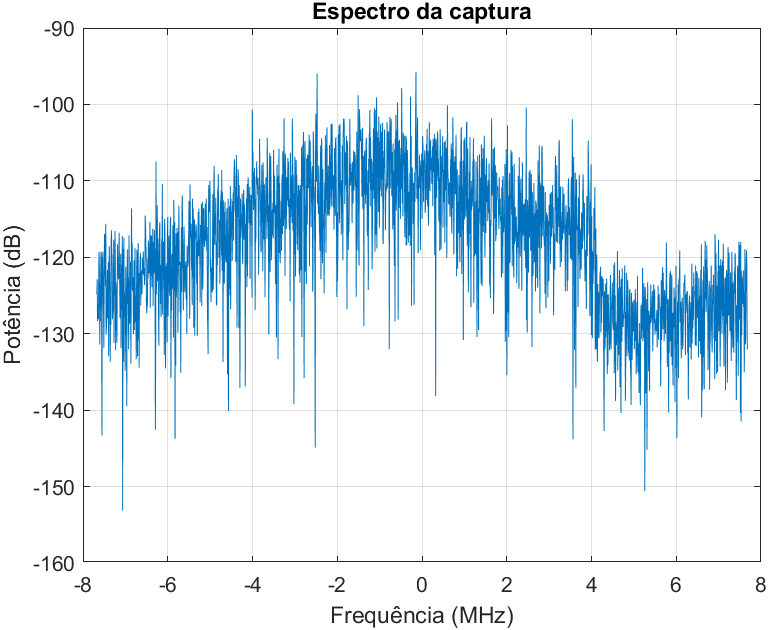
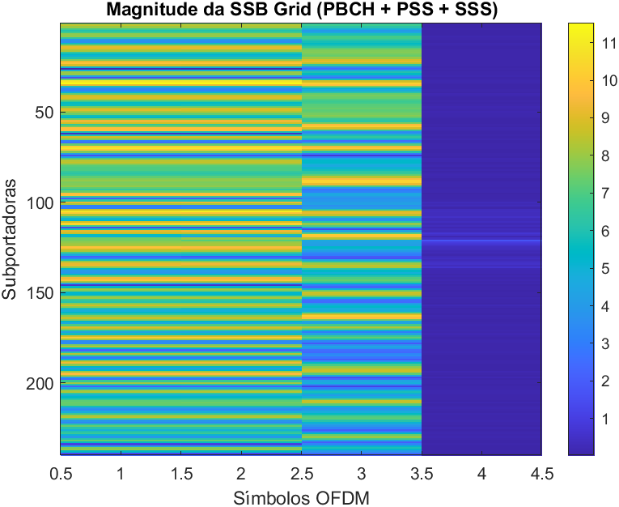
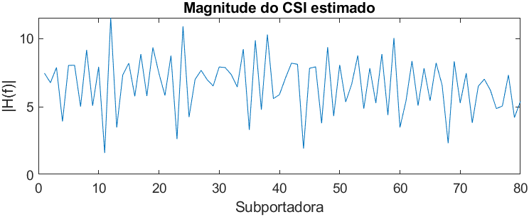
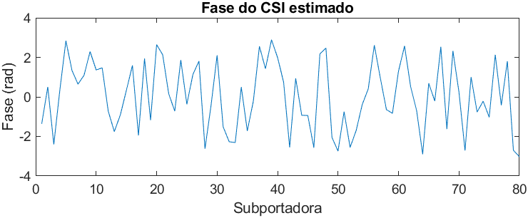

## Experimentos para extração do CSI com a SDR X310 em redes 5G

### 1. Introdução

Este documento descreve o processo técnico e os experimentos realizados para capturar a Informação do Estado do Canal (CSI) em redes 5G usando a USRP X310. A iniciativa faz parte dos estudos conduzidos dentro do eixo 1 do CERISE, com foco em sensoriamento sem fio e localização.

Inicialmente, investigamos a possibilidade de configurar a X310 como um equipamento de usuário (UE) usando o `srsRAN`, mas após testes e tentativas frustradas, optamos por trabalhar em modo de escuta passiva (passive sniffing). Este repositório documenta todas as etapas, configurações de software e hardware, além dos scripts utilizados para captura e análise dos dados.

### 2. Requisitos

A seguir estão listados os equipamentos utilizados, sistemas operacionais, drivers e ferramentas de software necessárias para replicar os experimentos.

#### 2.1. Equipamentos

- **USRP X310**
- **Antenas** conectadas aos canais RX
- **Computador host** com Linux Ubuntu 20.04 ou superior

#### 2.2. Softwares e versões

- **UHD (USRP Hardware Driver)** versão `4.8.0.0`
- **GNU Radio** versão compatível com UHD 4.8 (usamos Python 3.9 via Conda)
- **Conda** para gerenciamento de ambientes (`Miniconda` recomendado)
- **Git** para versionamento e clonagem de repositórios
- **MATLAB** (para processamento offline dos arquivos capturados)

#### 2.3. Instalação de dependências

Os comandos e ambientes utilizados foram organizados no ambiente `gr48`. A criação do ambiente pode ser feita assim:

```bash
conda create -n gr48 python=3.9
conda activate gr48
```

> **Nota:** Ao iniciar um novo terminal, lembre-se de ativar o ambiente gr48 antes de executar qualquer script.

```bash
conda activate gr48
```
### 3. Instalação e Configuração da X310

Esta etapa garante que o computador esteja pronto para comunicar com a USRP X310 e fazer capturas confiáveis em tempo real.

#### 3.1. Verificar conexão de rede com a USRP

Configure o IP da interface Ethernet para comunicar com a X310 (por padrão: `192.168.10.1`):

```bash
sudo ip addr add 192.168.10.1/24 dev <nome_da_interface>
sudo ip link set <nome_da_interface> up
```

Substitua `<nome_da_interface>` por `enp1s0`, `eth0`, ou outro, conforme seu sistema.

#### 3.2. Verificar comunicação com a placa

Use os comandos abaixo para checar a detecção da USRP:

```bash
uhd_find_devices
uhd_usrp_probe
```

Ambos devem identificar corretamente a X310. Se der erro, verifique cabo, IP e permissões.

### 3. Preparação do Ambiente e da SDR X310

A seguir, detalhamos os passos realizados para configurar corretamente a USRP X310, preparar o sistema operacional, instalar as dependências e verificar o funcionamento do hardware antes da coleta de dados.

#### 3.1. Configuração da conexão com a X310

Conecte a porta de rede 10G da USRP X310 diretamente ao computador host (ou via switch compatível) e configure a interface de rede com o seguinte IP:

```bash
sudo ip addr add 192.168.10.1/24 dev <sua_interface>
sudo ip link set <sua_interface> up
```

> Substitua `<sua_interface>` pelo nome da sua interface de rede (ex: `enp3s0`, `eth0`, etc.).

#### 3.2. Verificação da comunicação com a X310

Use os comandos abaixo para verificar se a X310 está corretamente conectada e acessível:

```bash
ping 192.168.10.2
```

Se o ping responder, teste a comunicação via UHD:

```bash
uhd_usrp_probe
```

Esse comando deve exibir informações da placa, como o modelo (X310), subdevices (UBX RX/TX), versão do FPGA, etc.

#### 3.3. Atualização da imagem do FPGA

Caso a versão do UHD no host seja mais recente do que a do FPGA embarcado, será necessário atualizá-lo:

```bash
sudo uhd_images_downloader
sudo uhd_image_loader --args="type=x300,addr=192.168.10.2"
```

Aguarde a conclusão do processo e reinicie a USRP, se necessário.

#### 3.4. Instalação do Miniconda

Baixe o instalador mais recente do [Miniconda](https://docs.conda.io/en/latest/miniconda.html) e execute:

```bash
bash Miniconda3-latest-Linux-x86_64.sh
```

Após instalar, crie o ambiente com a versão apropriada do Python:

```bash
conda create -n gr48 python=3.9
conda activate gr48
```

> Lembre-se de ativar o ambiente `gr48` sempre que iniciar um novo terminal:
>
> ```bash
> conda activate gr48
> ```

#### 3.5. Instalação do UHD e GNU Radio

Instale o UHD e outras dependências:

```bash
sudo apt install uhd-host libuhd-dev
```

Com o `gr48` ativado, instale o GNU Radio via Conda:

```bash
conda install -c conda-forge gnuradio
```

Você pode especificar uma versão mais exata, se necessário:

```bash
conda install -c conda-forge gnuradio=3.10
```

#### 3.6. Tentativa de operação como UE com srsUE

Inicialmente, testamos configurar a X310 como um equipamento de usuário (UE) usando o `srsRAN` (v4). O processo incluiu:

- Clonagem e compilação do `srsRAN`
- Configuração dos arquivos `.conf` com parâmetros da operadora
- Sincronização com gNB comercial

Apesar das tentativas, **não foi possível concluir a sincronização com sucesso**. A X310 apresentou incompatibilidades em relação ao funcionamento esperado como UE. Por esse motivo, **optamos por seguir com a abordagem de escuta passiva**, descrita na próxima seção.

### 4. Scripts de captura e visualização em tempo real

Após a configuração do ambiente, realizamos as capturas de amostras diretamente da USRP X310 utilizando dois métodos principais:

#### 4.1. Captura com `rx_samples_to_file` (UHD)

Este método grava os dados diretamente em um arquivo `.dat` no formato especificado (por padrão, `short` = 16 bits). Os parâmetros mais utilizados estão destacados abaixo:

```bash
sudo ./rx_samples_to_file   --file=captura_A.dat   --rate=15.36e6   --freq=3500e6   --gain=40   --duration=3   --type=short
```

- `--file`: nome do arquivo de saída
- `--rate`: taxa de amostragem (em Hz)
- `--freq`: frequência central (em Hz)
- `--gain`: ganho de recepção
- `--duration`: tempo total da gravação (em segundos)
- `--type`: tipo dos dados (`short` ou `float`)

> **Nota:** Para experimentos compatíveis com OFDM 5G NR (subcarrier spacing de 30 kHz), usamos múltiplos de 15.36 MHz como taxa de amostragem, como por exemplo 15.36e6 ou 30.72e6.

#### 4.2. Visualização em tempo real com `uhd_fft`

Para validar a recepção e sintonização, utilizamos o `uhd_fft` do GNU Radio, que apresenta um gráfico espectral em tempo real:

```bash
uhd_fft --freq 3500e6 --samp-rate 15.36e6 --gain 40
```

Caso o comando esteja fora do caminho, verifique se o ambiente `gr48` está ativado:

```bash
conda activate gr48
```

#### 4.3. Captura alternativa com `uhd_rx_cfile` (GNU Radio)

Outra opção para capturar amostras diretamente do GNU Radio em um arquivo `.dat`:

```bash
uhd_rx_cfile -f 3500e6 -r 15.36e6 -g 40 -N 46080000 captura_B.dat
```

- `-f`: frequência central (Hz)
- `-r`: taxa de amostragem
- `-g`: ganho
- `-N`: número total de amostras (exemplo: 15.36e6 × 3 s = 46080000)

> **Importante:** Para evitar erro de permissão, certifique-se de ter permissões de escrita no diretório de destino ou execute com `sudo`.

### 5. Processamento dos dados capturados (MATLAB)

A análise dos sinais capturados é realizada com apoio de scripts em MATLAB. Todas as funções estão organizadas na pasta `matlab/`.

#### 5.1 Estrutura

- `matlab/`
  - `main.m` — script principal de orquestração.
  - `lerArquivo.m`, `plotarFFT.m`, `detectarPSS.m`, `extrairCSI.m`, etc. — funções auxiliares, devidamente comentadas.

#### 5.2 Como executar

1. No MATLAB, abra o diretório `matlab/`.
2. Edite o início do script `main.m` para configurar:
   - O nome do arquivo de captura `.dat`
   - A taxa de amostragem (tipicamente 15.36 MHz)
   - O tipo de dado (`int16` ou `float`)
3. Execute o script `main.m`. Ele seguirá automaticamente as etapas abaixo:

#### 5.3 Etapas realizadas pelo `main.m`

1. Leitura e conversão do arquivo `.dat` em vetor complexo.
2. Exibição do espectro (FFT) bruto do sinal.
3. Detecção da posição do PSS por correlação.
4. Alinhamento do grid OFDM (baseado no PSS).
5. Extração da matriz de símbolos.
6. Cálculo e exibição do CSI (magnitude e fase).

Todas as funções estão comentadas dentro dos arquivos `.m`.

### 6. Análise e Resultados

O processamento dos dados capturados é realizado via `MATLAB`, por meio do script principal `main.m` localizado na pasta [`matlab/`](matlab/). Esse script orquestra automaticamente as etapas de leitura do arquivo `.dat`, extração de símbolos, sincronização e, por fim, a obtenção do CSI.

#### 6.1 Entradas
- Os arquivos `.dat` gerados a partir das capturas com a USRP X310 foram organizados em uma pasta separada denominada `capturas/`. Como esses arquivos costumam ultrapassar o limite de 100 MB imposto pelo GitHub, **eles não foram incluídos diretamente no repositório**.

Para acessar os arquivos de captura utilizados nos experimentos descritos aqui, utilize o seguinte link:

🔗 [Download dos arquivos de captura (.dat)](https://drive.google.com/drive/folders/1wiMw0UAV4H4bGj_NnSg4ioZgZrgRoDyT?usp=sharing)

> Obs.: Caso o link não esteja disponível, entre em contato com os autores do projeto para solicitar acesso.
- A captura deve ser selecionada manualmente no início do script `main.m`.

#### 6.2 Etapas do processamento e resultados gerados

O `main.m` realiza as seguintes etapas, com geração de figuras e/ou variáveis a cada passo:

1. **Leitura do arquivo de captura**
   - Interpretação dos dados como números complexos (formato `int16` ou `float`)
2. **Visualização da magnitude bruta**
   - Permite observar a estrutura geral do sinal recebido

   

3. **Correlação com o PSS**
   - Localiza padrões e permite estimar o início dos quadros

   

4. **Visualização do grid de símbolos**
   - Identificação visual dos símbolos OFDM presentes

   

5. **Extração do CSI**
   - Extração do CSI (Channel State Information) por subportadora
   - Geração dos gráficos de magnitude e fase

   
   
   